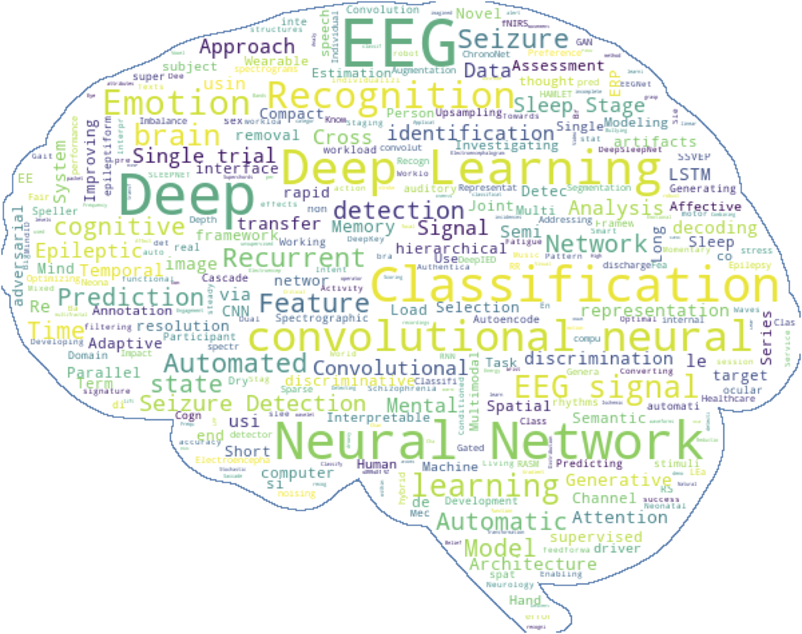

# Data collection table and code for "Deep learning-based EEG analysis: a systematic review"

<p align="center">

</p>

This repository contains the data collection table and code for our [systematic review on deep learning and EEG](https://arxiv.org/abs/1901.05498).
The systematic review currently contains 156 journal papers, conference papers and preprints.
Only studies applying deep learning to scalp EEG data were included. 

## Data tables

We provide our [data extraction table](https://docs.google.com/spreadsheets/d/1smpU0WSlSq-Al2u_QH3djGn68mTuHlth2fNJTrD3wa8/) containing the summary of the reviewed papers. This table will be maintained and updated over time and might therefore be slightly out-of-sync with the review as new articles are added. Each row contains the information for a single paper, while the columns are "data items" (e.g., 'domain of application', 'type of architecture', 'number of layers', etc.) describing the various characteristics of the studies.

A CSV version of the table is available under `/data/data_items.csv`. This version is used to automatically generate all the figures in the review. The CSV file is updated everytime the main table is modified.

An additional table containing the [reported results](https://docs.google.com/spreadsheets/d/1smpU0WSlSq-Al2u_QH3djGn68mTuHlth2fNJTrD3wa8/edit#gid=1960227030) of each paper is also made available. Its CSV version can be found under `/data/reporting_results.csv`.

## Contributing

We encourage interested readers to submit new DL-EEG papers to be included in the data collection tables so their summary can be shared with the rest of the community. If your work is already in the data collection tables, we would be grateful to have you approve the summary we did of your paper. If you have published work on DL-EEG that is not included in the table, we would be very happy to include your summary in the tables. Lastly, please let us know if you see any error in the tables.

Depending on the kind of contribution you are planning on doing, please see the following steps:

1. **Modifying or correcting existing entries**
    - Option 1: **Open an issue** on Github to discuss what you are suggesting to add to/modify in the data collection table.
    - Option 2: **Submit a pull request** on Github to directly suggest changes to the `data_items.csv` and `reporting_results.csv` files.
    - Option 3: **Send us an email** with the suggested modifications.

2. **Reviewing a new paper**
    - Download and fill [this template](https://docs.google.com/spreadsheets/d/1QKc7U3LxBguIT72qG3ZwqtrOzzviP5VU0JMioAz4Kgw/). See `REVIEWING_INSTRUCTIONS.md` for more details on how to fill out the different parts of the tables.
    - Option 1: **Submit a pull request** on Github with your CSV file (i.e., filled template) in the folder _submissions_.
    - Option 2: **Send us an email** with the filled template, either a link to a spreadsheet or a CSV file attached to the email.

3. **Reviewing a Paper**
    1. **Consult the spreadsheet** for the list "To be reviewed" in the second tab.
    2. **Identify a paper of interest** from the list and review it throughfully to fill all the data items (i.e. columns)
    4. **See previous section** "New Reviewed Paper" so we can update the spreadsheet with your contribution.

4. **Requesting the inclusion of a new paper**
    - Option 1: **Open an issue** on Github with the title of the paper, the list of authors and the year, as well as a link to an electronic version of the paper.
    - Option 2: **Send us an email** with the information described just above.

## Producing the figures and results of the review

To produce the figures and results of the review, a Python 3 environment with the packages listed in `requirements.txt` is necessary.
The packages can be installed with:

```
pip install -r requirements.txt
```

`Graphviz` also needs to be installed : see [instructions](https://www.graphviz.org/download/).

Then, run the `generate_results.py` script:

```
cd dl-eeg-review/code/
python generate_results.py
```

This will generate the figures and a log file containing the results under `figs/`.

### Using a colormap for grayscale printing

To generate the figures using a colormap that is grayscale printing-friendly, change the value of the variable `palette` in `config.py` before calling `generate_results.py`. For example, `palette = 'cubehelix'` will make use of the cubehelix palette.

## DL-EEG Checklist

In order to help standardize the way DL-EEG results are reported, we provide a checklist to help you confirm that your manuscript has all the important elements to maximize its quality and reproducibility.

*[DL-EEG Checklist](DL-EEG_Checklist.pdf)*

## Citation

If our review is useful to your work and you use the data tables, figures or information from the review we thank you for citing it:

_Roy Y., Banville H., Albuquerque I., Gramfort A., Falk T.H. & Faubert J., (2019). Deep learning-based electroencephalography analysis: a systematic review. arXiv preprint arXiv:1901.05498._

